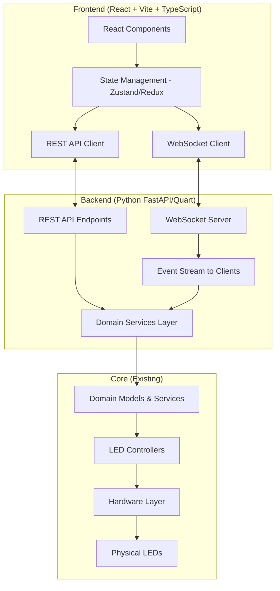

# Diuna LED Control System - Professional Architecture Refactoring Plan

## Executive Summary

Your Diuna project has evolved from a fun prototype to a serious, well-architected system (~9,400 lines of Python) with impressive technical maturity. The codebase demonstrates strong architectural thinking with layered design, domain-driven patterns, event-driven architecture, and professional separation of concerns. However, as you correctly identified, you're at a critical inflection point where proper architecture becomes **essential** before adding frontend and expanding features.

**Current State:** B+ grade production-ready hobby system with Phase 7 unified rendering achieved  
**Target State:** A-grade professional application ready for frontend integration and feature expansion

---

## Part 1: Current Architecture Assessment

### What You've Built (Strengths to Preserve)

#### 1. Excellent Layered Architecture ✅

Your 5-layer architecture is clean and well-separated:

```
Layer 4: Infrastructure (Config, Events, Logging, GPIO)
Layer 3: Application (Controllers, Orchestration)  
Layer 2: Domain (Models, Services, Business Logic)
Layer 1: Hardware Abstraction (Components - Button, Encoder, LED strips)
Layer 0: GPIO Infrastructure (GPIOManager - centralized pin management)
```

**Why This Is Great:**
- Clear separation of concerns
- Each layer has single responsibility  
- Dependencies flow downward only
- Easy to test individual layers

#### 2. Domain-Driven Design Pattern ✅

Your Config-State-Combined pattern is **excellent**:

```python
# Immutable configuration from YAML
@dataclass(frozen=True)
class ZoneConfig:
    id: ZoneID
    display_name: str
    pixel_count: int
    
# Mutable runtime state from JSON  
@dataclass
class ZoneState:
    id: ZoneID
    color: Color
    
# Aggregate root combining both
class ZoneCombined:
    config: ZoneConfig
    state: ZoneState
    parameters: Dict[ParamID, ParameterCombined]
```

**Why This Is Great:**
- Clear separation: configuration vs runtime state
- Immutable config prevents accidental changes
- Easy to persist state without touching config
- Pattern consistently applied to Zone, Animation, Parameter domains

#### 3. Type Safety with Enums ✅

```python
class ZoneID(Enum):
    FLOOR = auto()
    LAMP = auto()
    
class AnimationID(Enum):
    BREATHE = auto()
    COLOR_CYCLE = auto()
    
class ParamID(Enum):
    ZONE_COLOR_HUE = auto()
    ZONE_BRIGHTNESS = auto()
```

**Why This Is Great:**
- Zero string typos
- IDE autocomplete support
- Refactoring-safe (rename propagates)
- Type checking catches errors at development time

#### 4. Event-Driven Input Architecture ✅

```python
# Hardware publishes events
event_bus.publish(EncoderRotateEvent(...))

# Controllers subscribe  
event_bus.subscribe(EventType.ENCODER_ROTATE, self._handle_encoder_rotate)
```

**Why This Is Great:**
- Decouples hardware from business logic
- Easy to add new input sources (keyboard adapter added later)
- Priority-based handler execution
- Testable with mocked events

#### 5. Phase 7 Unified Rendering (FrameManager) ✅ BRILLIANT

Your FrameManager is **exceptionally well designed**:

```python
# Priority-based frame queues
self.main_queues: Dict[int, Deque[MainStripFrame]] = {
    p.value: deque(maxlen=2)
    for p in FramePriority
}

# Hardware timing enforcement  
MIN_FRAME_TIME_MS = 2.75  # WS2811 protocol constraint
```

**Why This Is Great:**
- Single point of rendering (no race conditions)
- Priority system allows overlays (power-off fade > animation)
- Hardware timing constraints enforced
- Supports multiple frame types (FullStrip, Zone, Pixel)
- Performance metrics tracking

#### 6. Service Layer with Repository Pattern ✅

```python
class ZoneService:
    def set_color(self, zone_id: ZoneID, color: Color):
        zone = self._by_id[zone_id]
        zone.state.color = color
        self.save()  # Auto-persist via DataAssembler
```

**Why This Is Great:**
- Single Responsibility: services coordinate domain objects
- DataAssembler is only component that touches JSON files
- Auto-save ensures state consistency
- Clear API for controllers

---

### Critical Issues Requiring Refactoring

#### 1. Parent-Child Controller Coupling ⚠️ HIGH PRIORITY

**Current Problem:**
```python
# led_controller.py
class LEDController:
    def __init__(self, ...):
        self.static_mode_controller = StaticModeController(self)  # Passes self

# static_mode_controller.py  
class StaticModeController:
    def __init__(self, parent: LEDController):
        self.parent = parent
        self.zone_service = parent.zone_service  # Direct access to parent internals
```

**Why This Is Bad:**
- Tight coupling: child knows parent's entire structure
- Hard to test: must mock entire LEDController
- Fragile refactoring: changing LEDController breaks all children
- Circular dependency: parent creates child, child references parent

**Impact on Frontend:** 
When adding REST API or WebSocket handlers, this pattern will force your API layer to depend on monolithic LEDController. You need fine-grained service access.

#### 2. Scattered Enum↔String Conversions ⚠️ MEDIUM PRIORITY

**Current Problem:**
```python
# animation_mode_controller.py
safe_params = {
    (k.name if hasattr(k, "name") else str(k)): v 
    for k, v in params.items()
}

# animation_service.py
params = {ParamID[k]: v for k, v in anim_data.items()}

# zone_strip.py
def _zone_key(self, zone: Any) -> Optional[str]:
    if isinstance(zone, ZoneID):
        return zone.name
    return zone if isinstance(zone, str) else None
```

**Why This Is Bad:**
- Conversion logic duplicated in 5+ places
- Some accept enum OR string (type safety lost)
- No single source of truth
- Error handling inconsistent

**Impact on Frontend:**
Your REST API will serialize to JSON (strings), so you need **one canonical place** for enum serialization/deserialization.

#### 3. Save-On-Every-Change Performance Risk ⚠️ MEDIUM PRIORITY

**Current Problem:**
```python
class ZoneService:
    def set_color(self, zone_id, color):
        zone.state.color = color
        self.save()  # Writes to disk IMMEDIATELY
```

**Why This Is Bad:**
- Rotating encoder fast = 10-20 saves/second
- Each save = JSON serialize + file write (5-10ms)
- SD card writes shorten Raspberry Pi SD card life
- No batching = wasted I/O

**Impact on Frontend:**
When frontend connects via WebSocket and sends rapid color changes (slider drag), this will cause stuttering and SD card wear.

#### 4. DataAssembler "God Class" ⚠️ MEDIUM PRIORITY

**Current Problem:**
```python
# data_assembler.py (306 lines)
class DataAssembler:
    def build_zones(self): ...
    def build_animations(self): ...
    def build_application_state(self): ...
    def build_parameters(self): ...
    def save_zone_state(self): ...
    def save_animation_state(self): ...
    def save_application_state(self): ...
```

**Why This Is Bad:**
- Single file with 4 different responsibilities
- Hard to understand (jumps between zones, animations, params)
- Growing complexity as features added
- Violates Single Responsibility Principle

**Impact on Frontend:**
When you add frontend state, user preferences, saved presets, you'll keep piling into this file. Need modular approach.

#### 5. Async Task Lifecycle Management ⚠️ LOW PRIORITY (But Causes Shutdown Warnings)

**Current Problem:**
```python
# static_mode_controller.py
def _stop_pulse(self):
    self.pulse_active = False
    if self.pulse_task:
        self.pulse_task.cancel()  # Doesn't await cancellation
```

**Why This Is Bad:**
- Task might not cancel immediately
- Shutdown logs show warnings about pending tasks
- Potential resource leaks

**Impact on Frontend:**
WebSocket connections are async tasks. Improper lifecycle = memory leaks when clients disconnect.

#### 6. Configuration Validation Missing ⚠️ LOW PRIORITY

**Current Problem:**
- YAML files have no schema validation
- Invalid enum names fail at runtime, not load time
- No validation of zone pixel ranges (overlapping zones would break)
- No validation of GPIO pin conflicts (only at runtime)

**Impact on Frontend:**
Configuration will include WebSocket ports, CORS settings, API keys. Need validation before app starts.

---

## Part 2: Frontend Integration Requirements

Before discussing refactoring, let's define what the frontend needs:

### Frontend Architecture Vision



### What Frontend Needs from Backend

#### 1. Real-Time State Synchronization

**Requirements:**
- When encoder changes hue, all connected clients see update instantly
- When animation starts, clients see preview + status
- When zone is edited, clients see which zone is active
- Power on/off, mode switches broadcast to all clients

**Protocol:** WebSocket (bidirectional)

**Example Message:**
```json
{
  "type": "zone_state_changed",
  "data": {
    "zone_id": "FLOOR",
    "color": {"mode": "HUE", "hue": 180},
    "brightness": 255
  }
}
```

#### 2. REST API for CRUD Operations

**Requirements:**
- GET /zones - list all zones with config + state
- PUT /zones/{id}/color - change zone color
- GET /animations - list available animations
- POST /animations/{id}/start - start animation
- GET /presets - list saved color presets
- POST /presets - save new preset

**Example Response:**
```json
{
  "zones": [
    {
      "id": "FLOOR",
      "display_name": "Floor Strip",
      "pixel_count": 45,
      "enabled": true,
      "state": {
        "color": {"mode": "HUE", "hue": 240},
        "brightness": 200
      }
    }
  ]
}
```

#### 3. Color System Frontend Needs

**Requirements:**
- RGB picker (0-255 per channel)
- HSV picker (hue 0-360, saturation 0-100, value 0-100)
- Hue-only picker (for rainbow effects)
- Preset picker (saved favorite colors)
- White modes (warm, cool, daylight)
- Brightness slider (0-255)
- Saturation adjustment
- Color temperature adjustment

**Your Current System Already Has:**
- Color model with HUE, PRESET, RGB modes ✅
- ColorManager with presets ✅
- Brightness per zone ✅

**What's Missing:**
- HSV full support (currently only hue)
- Color temperature (Kelvin) support
- Color palettes/themes
- Color history/recent colors

#### 4. Animation Control Frontend Needs

**Requirements:**
- List all animations with previews
- Start/stop/pause animation
- Adjust speed in real-time
- Adjust animation-specific parameters (colors, direction, etc.)
- Frame-by-frame mode for debugging
- Animation presets (saved parameter sets)

**Your Current System Already Has:**
- Animation registry ✅
- Live parameter updates ✅
- Frame-by-frame mode ✅
- Animation-specific parameters ✅

**What's Missing:**
- Animation preview thumbnails/videos
- Animation presets/favorites
- Animation scheduling (start at time, duration)

#### 5. Zone Management Frontend Needs

**Requirements:**
- Visual representation of LED layout (2D map of zones)
- Group zones (e.g., "All Desk", "All Ambient")
- Per-zone on/off toggle
- Per-zone brightness
- Zone reordering in UI
- Zone aliases/nicknames

**Your Current System Already Has:**
- Zone model with config + state ✅
- Per-zone color + brightness ✅
- Zone ordering ✅

**What's Missing:**
- Zone groups/scenes
- Zone layout coordinates (for 2D visualization)
- Zone preview (what physical LEDs belong to zone)

#### 6. User Experience Requirements

**Requirements:**
- Responsive design (phone, tablet, desktop)
- Touch-friendly (large buttons, sliders)
- Real-time feedback (no lag when adjusting)
- Smooth transitions (fade between colors)
- Visual preview of animations
- Keyboard shortcuts
- Dark/light theme
- Accessibility (screen readers, keyboard nav)

---

## Part 3: Refactoring Strategy

### Philosophy: Iterative, Risk-Managed Evolution

**Principles:**
1. **Don't rewrite from scratch** - You have working code, refactor incrementally
2. **Backend-first** - Fix architecture issues before adding frontend
3. **Feature branches** - Each refactor is isolated, tested, merged
4. **Parallel operation** - Keep current system running while refactoring
5. **Data compatibility** - Don't break existing state.json files

### Phase-Based Approach

---

## Phase 8A: Clean Up Technical Debt (Quickest Wins)

**Goal:** Remove duplicate code, fix obvious issues

**Effort:** 4-6 hours

**Risk:** Very Low (no architectural changes)

### Tasks:

#### 1. Remove Duplicate Files
```bash
# Delete old files
rm src/models/parameter.py  # Replaced by models/domain/parameter.py
rm src/utils/logger.py      # Replaced by utils/logger2.py

# Update all imports
# Find remaining imports: grep -r "from models.parameter" src/
# Find remaining imports: grep -r "from utils.logger import" src/
```

#### 2. Fix main_asyncio.py Cleanup Code

**Problem:** Duplicate cleanup logic (lines 263-268 vs 281-286)

**Solution:**
```python
# Extract to method
async def cleanup_application(led_controller, zone_strip_transition_service, gpio_manager):
    """Graceful shutdown sequence"""
    log.info("Stopping animations...")
    if led_controller.animation_engine and led_controller.animation_engine.is_running():
        await led_controller.animation_engine.stop()
    
    log.info("Stopping pulsing...")
    if led_controller.static_mode_controller:
        await led_controller.static_mode_controller.stop_pulse()  # Make public
    
    log.info("Performing shutdown transition...")
    await zone_strip_transition_service.fade_out(zone_strip_transition_service.SHUTDOWN)
    
    log.info("Clearing LEDs...")
    led_controller.clear_all()
    
    log.info("Cleaning up GPIO...")
    gpio_manager.cleanup()

# In main() finally block:
await cleanup_application(led_controller, zone_strip_transition_service, gpio_manager)
```

#### 3. Fix Async Task Cleanup

```python
# static_mode_controller.py
async def stop_pulse(self):  # Make public and async
    """Stop pulse animation gracefully"""
    self.pulse_active = False
    if self.pulse_task:
        self.pulse_task.cancel()
        try:
            await self.pulse_task
        except asyncio.CancelledError:
            pass
        self.pulse_task = None
```

#### 4. Remove Dead Code

```python
# main_asyncio.py lines 178-183 - duplicate condition
# DELETE:
if hasattr(led_controller, "frame_manager"):
    frame_manager = led_controller.frame_manager
elif hasattr(led_controller, "frame_manager"):  # DUPLICATE
    frame_manager = led_controller.frame_manager
```

**Deliverables:**
- Cleaner codebase
- No shutdown warnings
- Faster to navigate

---

## Phase 8B: Dependency Injection Refactor (Foundation for Frontend)

**Goal:** Decouple controllers, enable API layer to use services directly

**Effort:** 2-3 days

**Risk:** Medium (requires updating many files, but logic unchanged)

### Problem Illustrated:

**Current (Tight Coupling):**
```python
# Controllers depend on parent
class StaticModeController:
    def __init__(self, parent: LEDController):
        self.parent = parent
        self.zone_service = parent.zone_service  # Deep coupling
        
# To add REST API:
class ZoneAPI:
    def __init__(self, led_controller: LEDController):
        self.led_controller = led_controller
        # Must know LEDController internals to access services
```

**Target (Dependency Injection):**
```python
# Controllers get explicit dependencies
class StaticModeController:
    def __init__(
        self,
        zone_service: ZoneService,
        app_state_service: ApplicationStateService,
        frame_manager: FrameManager,
        strip_controller: ZoneStripController,
        preview_panel: PreviewPanelController,
        event_bus: EventBus
    ):
        self.zone_service = zone_service
        self.app_state_service = app_state_service
        # Clear, testable dependencies
        
# REST API gets same services
class ZoneAPI:
    def __init__(self, zone_service: ZoneService):
        self.zone_service = zone_service  # Direct access
```

### Implementation Steps:

#### Step 1: Define Service Layer Interface

Create `services/service_container.py`:

```python
from dataclasses import dataclass
from services import ZoneService, AnimationService, ApplicationStateService
from engine.frame_manager import FrameManager
from services.event_bus import EventBus

@dataclass
class ServiceContainer:
    """Dependency injection container for all services"""
    zone_service: ZoneService
    animation_service: AnimationService
    app_state_service: ApplicationStateService
    frame_manager: FrameManager
    event_bus: EventBus
    
    # Add more services as needed:
    # preset_service: PresetService
    # scene_service: SceneService
```

#### Step 2: Refactor StaticModeController

**Before:**
```python
class StaticModeController:
    def __init__(self, parent: LEDController):
        self.parent = parent
        self.zone_service = parent.zone_service
```

**After:**
```python
class StaticModeController:
    def __init__(
        self,
        services: ServiceContainer,
        strip_controller: ZoneStripController,
        preview_panel: PreviewPanelController
    ):
        self.zone_service = services.zone_service
        self.app_state_service = services.app_state_service
        self.frame_manager = services.frame_manager
        self.event_bus = services.event_bus
        
        self.strip_controller = strip_controller
        self.preview_panel = preview_panel
        
        # No parent reference needed
```

#### Step 3: Refactor AnimationModeController

Same pattern:
```python
class AnimationModeController:
    def __init__(
        self,
        services: ServiceContainer,
        animation_engine: AnimationEngine,
        strip_controller: ZoneStripController,
        preview_panel: PreviewPanelController
    ):
        self.animation_service = services.animation_service
        self.app_state_service = services.app_state_service
        # ...
```

#### Step 4: Update LEDController

```python
class LEDController:
    def __init__(
        self,
        services: ServiceContainer,
        config_manager: ConfigManager,
        gpio_manager: GPIOManager,
        zone_strip_controller: ZoneStripController,
        preview_panel_controller: PreviewPanelController
    ):
        self.services = services
        
        # Create child controllers with DI
        self.static_mode_controller = StaticModeController(
            services=services,
            strip_controller=zone_strip_controller,
            preview_panel=preview_panel_controller
        )
        
        self.animation_mode_controller = AnimationModeController(
            services=services,
            animation_engine=self.animation_engine,
            strip_controller=zone_strip_controller,
            preview_panel=preview_panel_controller
        )
```

#### Step 5: Update main_asyncio.py

```python
async def main():
    # ... existing setup ...
    
    # Create service container
    services = ServiceContainer(
        zone_service=zone_service,
        animation_service=animation_service,
        app_state_service=app_state_service,
        frame_manager=frame_manager,
        event_bus=event_bus
    )
    
    # Create controllers with DI
    led_controller = LEDController(
        services=services,
        config_manager=config_manager,
        gpio_manager=gpio_manager,
        zone_strip_controller=zone_strip_controller,
        preview_panel_controller=preview_panel_controller
    )
```

### Benefits:

✅ Controllers are testable (inject mock services)  
✅ API layer can use services directly (no LEDController dependency)  
✅ Clear dependency graph  
✅ Easy to add new services  
✅ Type-safe with dataclass

**Deliverables:**
- ServiceContainer class
- Refactored mode controllers (static, animation, lamp, power, frame playback)
- Updated LEDController
- Updated main_asyncio.py
- All tests passing

---

## Phase 8C: Centralize Enum Serialization (Frontend Compatibility)

**Goal:** Single source of truth for enum↔string/dict conversion (for JSON API)

**Effort:** 1 day

**Risk:** Low (pure refactor, no logic changes)

### Problem:

Frontend JSON API will look like:
```json
{
  "zone_id": "FLOOR",  // String, not enum
  "color": {"mode": "HUE", "hue": 240},
  "animation_id": "COLOR_CYCLE"
}
```

Need bidirectional conversion:
- **Serialize:** `ZoneID.FLOOR` → `"FLOOR"`
- **Deserialize:** `"FLOOR"` → `ZoneID.FLOOR`

### Solution: Create Serialization Layer

#### Step 1: Create `utils/serialization.py`

```python
from typing import TypeVar, Type, Any, Dict, List, Optional
from enum import Enum
from models.enums import ZoneID, AnimationID, ParamID, ColorMode, MainMode
from models.color import Color
from models.domain.zone import ZoneConfig, ZoneState, ZoneCombined
from models.domain.animation import AnimationConfig, AnimationState, AnimationCombined

T = TypeVar('T', bound=Enum)

class Serializer:
    """Central enum and model serialization for JSON API"""
    
    # Enum → String
    @staticmethod
    def enum_to_str(value: Optional[Enum]) -> Optional[str]:
        """Convert any enum to string name"""
        return value.name if value else None
    
    # String → Enum
    @staticmethod
    def str_to_enum(value: str, enum_type: Type[T]) -> T:
        """Convert string to enum, raise ValueError if invalid"""
        try:
            return enum_type[value]
        except KeyError:
            raise ValueError(f"Invalid {enum_type.__name__}: {value}")
    
    # Zone Serialization
    @staticmethod
    def zone_to_dict(zone: ZoneCombined) -> Dict[str, Any]:
        """Serialize zone to JSON-compatible dict"""
        return {
            "id": zone.config.id.name,
            "display_name": zone.config.display_name,
            "pixel_count": zone.config.pixel_count,
            "enabled": zone.config.enabled,
            "state": {
                "color": Serializer.color_to_dict(zone.state.color),
                "brightness": zone.parameters[ParamID.ZONE_BRIGHTNESS].state.value
            }
        }
    
    @staticmethod
    def color_to_dict(color: Color) -> Dict[str, Any]:
        """Serialize color to dict"""
        result = {"mode": color.mode.name}
        if color.mode == ColorMode.HUE:
            result["hue"] = color._hue
        elif color.mode == ColorMode.RGB:
            result["rgb"] = color._rgb
        elif color.mode == ColorMode.PRESET:
            result["preset_name"] = color._preset_name
        return result
    
    @staticmethod
    def dict_to_color(data: Dict[str, Any]) -> Color:
        """Deserialize dict to Color"""
        mode = ColorMode[data["mode"]]
        if mode == ColorMode.HUE:
            return Color.from_hue(data["hue"])
        elif mode == ColorMode.RGB:
            return Color.from_rgb(*data["rgb"])
        elif mode == ColorMode.PRESET:
            return Color.from_preset(data["preset_name"], color_manager=None)  # Need color_manager
        raise ValueError(f"Unsupported color mode: {mode}")
    
    # Animation Serialization
    @staticmethod
    def animation_to_dict(anim: AnimationCombined) -> Dict[str, Any]:
        """Serialize animation to dict"""
        return {
            "id": anim.config.id.name,
            "display_name": anim.config.display_name,
            "description": anim.config.description,
            "enabled": anim.config.enabled,
            "parameters": {
                param_id.name: anim.parameters[param_id].state.value
                for param_id in anim.parameters
            }
        }
    
    # Parameter Dict Conversion (for AnimationEngine)
    @staticmethod
    def params_enum_to_str(params: Dict[ParamID, Any]) -> Dict[str, Any]:
        """Convert ParamID keys to strings (for AnimationEngine)"""
        return {k.name: v for k, v in params.items()}
    
    @staticmethod
    def params_str_to_enum(params: Dict[str, Any]) -> Dict[ParamID, Any]:
        """Convert string keys to ParamID (from JSON API)"""
        return {ParamID[k]: v for k, v in params.items()}
```

#### Step 2: Update All Callsites

**AnimationModeController:**
```python
# Before:
safe_params = {(k.name if hasattr(k, "name") else str(k)): v for k, v in params.items()}

# After:
from utils.serialization import Serializer
safe_params = Serializer.params_enum_to_str(params)
```

**ZoneStrip:**
```python
# Before:
def _zone_key(self, zone: Any) -> Optional[str]:
    if isinstance(zone, ZoneID):
        return zone.name
    return zone if isinstance(zone, str) else None

# After:
def _zone_key(self, zone: ZoneID) -> str:
    """Convert ZoneID to string key"""
    return Serializer.enum_to_str(zone)
```

#### Step 3: Update AnimationService Parameter Building

```python
# animation_service.py
from utils.serialization import Serializer

class AnimationService:
    def get_engine_params(self, animation: AnimationCombined) -> Dict[str, Any]:
        """Build parameters for animation engine (string keys)"""
        params = animation.build_params_for_engine()  # Returns Dict[ParamID, Any]
        return Serializer.params_enum_to_str(params)
```

### Benefits:

✅ Single source of truth for serialization  
✅ Type-safe conversion with error handling  
✅ Easy to extend for new models  
✅ Frontend API ready  
✅ Consistent error messages

**Deliverables:**
- `utils/serialization.py` module
- Updated controllers using Serializer
- Updated ZoneStrip using Serializer
- Tests for serialization

---

## Phase 8D: Add Save Debouncing (Performance + SD Card Life)

**Goal:** Batch disk writes to prevent SD card wear and improve performance

**Effort:** 4-6 hours

**Risk:** Low (add optional feature, don't break existing)

### Current Problem:

```python
# Rotate encoder 10 times in 1 second
# = 10 encoder events
# = 10 service.save() calls
# = 10 JSON writes to SD card
# = SD card wear + potential stuttering
```

### Solution: Debounced Save

#### Implementation:

```python
# services/debounced_save.py

import asyncio
from typing import Callable, Optional

class DebouncedSave:
    """Debounces save operations to batch rapid changes"""
    
    def __init__(self, save_callback: Callable, delay_ms: int = 200):
        """
        Args:
            save_callback: Async function to call when saving
            delay_ms: Delay in milliseconds before saving
        """
        self.save_callback = save_callback
        self.delay_ms = delay_ms
        self._timer_task: Optional[asyncio.Task] = None
        self._pending = False
    
    def trigger_save(self):
        """Schedule a save (cancels previous pending save)"""
        self._pending = True
        
        # Cancel existing timer
        if self._timer_task and not self._timer_task.done():
            self._timer_task.cancel()
        
        # Start new timer
        self._timer_task = asyncio.create_task(self._delayed_save())
    
    async def _delayed_save(self):
        """Wait for delay, then save if still pending"""
        try:
            await asyncio.sleep(self.delay_ms / 1000)
            if self._pending:
                await self.save_callback()
                self._pending = False
        except asyncio.CancelledError:
            pass  # Timer was cancelled, don't save
    
    async def flush(self):
        """Immediately save if pending (for shutdown)"""
        if self._pending:
            if self._timer_task:
                self._timer_task.cancel()
            await self.save_callback()
            self._pending = False
```

#### Update Services:

```python
# services/zone_service.py

from services.debounced_save import DebouncedSave

class ZoneService:
    def __init__(self, assembler: DataAssembler, debounce_ms: int = 200):
        self.assembler = assembler
        self.zones = assembler.build_zones()
        self._by_id = {zone.config.id: zone for zone in self.zones}
        
        # Add debouncer
        self._debounced_save = DebouncedSave(
            save_callback=self._save_to_disk,
            delay_ms=debounce_ms
        )
    
    async def _save_to_disk(self):
        """Actual save implementation"""
        self.assembler.save_zone_state(self.zones)
    
    def save(self):
        """Trigger debounced save"""
        self._debounced_save.trigger_save()
    
    async def flush_save(self):
        """Force immediate save (for shutdown)"""
        await self._debounced_save.flush()
```

#### Update Cleanup:

```python
# main_asyncio.py cleanup
async def cleanup_application(...):
    # Flush pending saves before shutdown
    log.info("Flushing pending saves...")
    await zone_service.flush_save()
    await animation_service.flush_save()
    await app_state_service.flush_save()
    
    # ... rest of cleanup ...
```

### Configuration:

Make debounce delay configurable:

```yaml
# config/config.yaml
system:
  save_debounce_ms: 200  # Delay before writing to disk
```

### Benefits:

✅ Reduces disk writes by 10-50x during rapid changes  
✅ Extends SD card life  
✅ Smoother experience (no I/O hiccups)  
✅ Configurable per deployment  
✅ Graceful shutdown still saves pending changes

**Deliverables:**
- DebouncedSave utility class
- Updated ZoneService with debouncing
- Updated AnimationService with debouncing
- Updated ApplicationStateService with debouncing
- Flush logic in cleanup
- Config option for debounce delay

---

## Phase 8B Status: ✅ COMPLETE (2025-11-17)

**Completed By:** Phase 8B Implementation
**Modified Files:**
- `src/services/service_container.py` (NEW) - DI container with zone_service, animation_service, app_state_service, frame_manager, event_bus, color_manager
- `src/controllers/led_controller/static_mode_controller.py` - Removed parent coupling, uses ServiceContainer
- `src/controllers/led_controller/animation_mode_controller.py` - Removed parent coupling, uses ServiceContainer
- `src/controllers/led_controller/lamp_white_mode_controller.py` - Removed parent coupling, uses ServiceContainer
- `src/controllers/led_controller/power_toggle_controller.py` - Removed parent coupling, uses main_mode_getter lambda
- `src/controllers/led_controller/led_controller.py` - Creates ServiceContainer, passes to all child controllers

**Result:** All parent-child controller tight coupling eliminated. Controllers now receive explicit dependencies via constructor. API layer can now use ServiceContainer directly without LEDController coupling.

---

## Phase 8C Status: ✅ COMPLETE (2025-11-17)

**Completed By:** Phase 8C Implementation + Manual Bug Fix
**Created Files:**
- `src/utils/serialization.py` - Serializer class with enum↔string and model↔dict conversion methods

**Modified Files:**
- `src/controllers/led_controller/animation_mode_controller.py` - Uses Serializer.params_enum_to_str() instead of manual conversion
- `src/controllers/led_controller/power_toggle_controller.py` - Uses Serializer.params_enum_to_str()
- `src/controllers/led_controller/led_controller.py` - Uses Serializer.params_enum_to_str()
- `src/models/domain/parameter.py` - Fixed BoundLogger.for_category() → with_category() (bugfix)

**Result:** Single source of truth for enum serialization. All param conversions now use Serializer instead of inline dict comprehensions. Logger bug fixed. Ready for JSON API layer.

---

## Phase 9: Backend API Layer (FastAPI)

**Goal:** Add REST + WebSocket API for frontend

**Effort:** 1-2 weeks

**Risk:** Low (new code, doesn't touch existing)

### Technology Choice: FastAPI

**Why FastAPI:**
- Async-native (works with your asyncio architecture)
- Automatic OpenAPI docs
- Type validation with Pydantic
- WebSocket support built-in
- Easy to deploy (Uvicorn)

**Alternative:** Quart (Flask-like async), but FastAPI is more popular and better documented

### Architecture:

```
src/
├── api/                      # NEW: API layer
│   ├── __init__.py
│   ├── main.py              # FastAPI app setup
│   ├── routes/
│   │   ├── __init__.py
│   │   ├── zones.py         # Zone endpoints
│   │   ├── animations.py    # Animation endpoints
│   │   ├── colors.py        # Color/preset endpoints
│   │   ├── system.py        # System status endpoints
│   │   └── websocket.py     # WebSocket endpoint
│   ├── models/              # Pydantic models (API contracts)
│   │   ├── __init__.py
│   │   ├── zone.py          # ZoneResponse, ZoneUpdateRequest
│   │   ├── animation.py
│   │   ├── color.py
│   │   └── system.py
│   └── dependencies.py      # FastAPI dependency injection
```

### Implementation:

#### Step 1: FastAPI Setup

```python
# api/main.py

from fastapi import FastAPI
from fastapi.middleware.cors import CORSMiddleware
from api.routes import zones, animations, colors, system, websocket
from services import ServiceContainer

def create_app(services: ServiceContainer) -> FastAPI:
    """Create and configure FastAPI application"""
    app = FastAPI(
        title="Diuna LED Control API",
        description="REST + WebSocket API for LED control system",
        version="1.0.0"
    )
    
    # CORS for frontend
    app.add_middleware(
        CORSMiddleware,
        allow_origins=["*"],  # Configure in production
        allow_credentials=True,
        allow_methods=["*"],
        allow_headers=["*"],
    )
    
    # Store services in app state
    app.state.services = services
    
    # Register routes
    app.include_router(zones.router, prefix="/api/zones", tags=["zones"])
    app.include_router(animations.router, prefix="/api/animations", tags=["animations"])
    app.include_router(colors.router, prefix="/api/colors", tags=["colors"])
    app.include_router(system.router, prefix="/api/system", tags=["system"])
    app.include_router(websocket.router, prefix="/ws", tags=["websocket"])
    
    return app
```

#### Step 2: Zone Endpoints

```python
# api/routes/zones.py

from fastapi import APIRouter, Depends, HTTPException
from typing import List
from api.models.zone import ZoneResponse, ZoneUpdateRequest
from api.dependencies import get_zone_service
from services import ZoneService
from utils.serialization import Serializer

router = APIRouter()

@router.get("/", response_model=List[ZoneResponse])
async def list_zones(zone_service: ZoneService = Depends(get_zone_service)):
    """Get all zones with current state"""
    zones = zone_service.get_all()
    return [Serializer.zone_to_dict(zone) for zone in zones]

@router.get("/{zone_id}", response_model=ZoneResponse)
async def get_zone(zone_id: str, zone_service: ZoneService = Depends(get_zone_service)):
    """Get single zone by ID"""
    try:
        zone_enum = Serializer.str_to_enum(zone_id, ZoneID)
        zone = zone_service.get_zone(zone_enum)
        return Serializer.zone_to_dict(zone)
    except ValueError:
        raise HTTPException(status_code=404, detail=f"Zone not found: {zone_id}")

@router.put("/{zone_id}/color")
async def update_zone_color(
    zone_id: str,
    request: ZoneUpdateRequest,
    zone_service: ZoneService = Depends(get_zone_service)
):
    """Update zone color"""
    try:
        zone_enum = Serializer.str_to_enum(zone_id, ZoneID)
        color = Serializer.dict_to_color(request.color)
        zone_service.set_color(zone_enum, color)
        return {"status": "ok", "zone_id": zone_id}
    except ValueError as e:
        raise HTTPException(status_code=400, detail=str(e))
```

#### Step 3: Pydantic Models

```python
# api/models/zone.py

from pydantic import BaseModel, Field
from typing import Optional, Dict, Any

class ColorModel(BaseModel):
    mode: str  # "HUE", "RGB", "PRESET"
    hue: Optional[int] = Field(None, ge=0, le=360)
    rgb: Optional[tuple[int, int, int]] = None
    preset_name: Optional[str] = None

class ZoneStateModel(BaseModel):
    color: ColorModel
    brightness: int = Field(ge=0, le=255)

class ZoneResponse(BaseModel):
    id: str
    display_name: str
    pixel_count: int
    enabled: bool
    state: ZoneStateModel

class ZoneUpdateRequest(BaseModel):
    color: Optional[ColorModel] = None
    brightness: Optional[int] = Field(None, ge=0, le=255)
```

#### Step 4: Dependency Injection

```python
# api/dependencies.py

from fastapi import Depends, Request
from services import ZoneService, AnimationService, ApplicationStateService

def get_services(request: Request):
    """Get ServiceContainer from app state"""
    return request.app.state.services

def get_zone_service(services = Depends(get_services)) -> ZoneService:
    return services.zone_service

def get_animation_service(services = Depends(get_services)) -> AnimationService:
    return services.animation_service

def get_app_state_service(services = Depends(get_services)) -> ApplicationStateService:
    return services.app_state_service
```

#### Step 5: WebSocket Real-Time Updates

```python
# api/routes/websocket.py

from fastapi import APIRouter, WebSocket, WebSocketDisconnect, Depends
from typing import Set
import asyncio
import json
from services import EventBus
from models.events import EventType, Event
from api.dependencies import get_services

router = APIRouter()

# Connected clients
connected_clients: Set[WebSocket] = set()

@router.websocket("/events")
async def websocket_endpoint(websocket: WebSocket, services = Depends(get_services)):
    """WebSocket endpoint for real-time state updates"""
    await websocket.accept()
    connected_clients.add(websocket)
    
    event_bus: EventBus = services.event_bus
    
    # Subscribe to all events and forward to this client
    async def forward_event(event: Event):
        """Forward event to WebSocket client"""
        try:
            await websocket.send_json({
                "type": event.type.name,
                "data": event.__dict__
            })
        except Exception:
            pass  # Client disconnected
    
    # Subscribe to events
    event_bus.subscribe(EventType.ZONE_STATE_CHANGED, forward_event)
    event_bus.subscribe(EventType.ANIMATION_STARTED, forward_event)
    event_bus.subscribe(EventType.ANIMATION_STOPPED, forward_event)
    
    try:
        while True:
            # Receive messages from client (commands)
            data = await websocket.receive_json()
            # Handle client commands here
            # e.g., {"action": "set_color", "zone_id": "FLOOR", "color": {...}}
    except WebSocketDisconnect:
        connected_clients.remove(websocket)
```

#### Step 6: Integrate with main_asyncio.py

```python
# main_asyncio.py

import uvicorn
from api.main import create_app

async def main():
    # ... existing setup ...
    
    # Create service container
    services = ServiceContainer(...)
    
    # Create FastAPI app
    api_app = create_app(services)
    
    # Start FastAPI server in background
    config = uvicorn.Config(
        api_app,
        host="0.0.0.0",
        port=8000,
        log_level="info"
    )
    server = uvicorn.Server(config)
    api_task = asyncio.create_task(server.serve())
    
    # ... rest of existing code ...
    
    try:
        await asyncio.gather(keyboard_task, polling_task, api_task)
    finally:
        # Shutdown API server
        server.should_exit = True
        await api_task
```

### Testing API:

```bash
# Get all zones
curl http://localhost:8000/api/zones

# Update zone color
curl -X PUT http://localhost:8000/api/zones/FLOOR/color \
  -H "Content-Type: application/json" \
  -d '{"color": {"mode": "HUE", "hue": 180}}'

# View auto-generated docs
# Open: http://localhost:8000/docs
```

**Deliverables:**
- FastAPI application with all REST endpoints
- WebSocket endpoint for real-time updates
- Pydantic models for API contracts
- OpenAPI documentation
- Integration with existing services
- CORS configuration

---

## Phase 10: Frontend Application (React + TypeScript)

**Goal:** Build modern, responsive web UI

**Effort:** 2-4 weeks

**Risk:** Low (new code, doesn't touch backend)

### Technology Stack:

```
Frontend Stack:
├── React 18           # UI framework
├── TypeScript         # Type safety
├── Vite              # Build tool (faster than Create React App)
├── Tailwind CSS      # Utility-first CSS
├── Zustand           # Lightweight state management
├── React Query       # Data fetching + caching
├── WebSocket client  # Real-time updates
└── React Color       # Color pickers
```

### Project Structure:

```
frontend/
├── src/
│   ├── api/                  # API client
│   │   ├── client.ts         # Axios/Fetch wrapper
│   │   ├── zones.ts          # Zone endpoints
│   │   ├── animations.ts     # Animation endpoints
│   │   └── websocket.ts      # WebSocket client
│   ├── components/
│   │   ├── zones/
│   │   │   ├── ZoneList.tsx
│   │   │   ├── ZoneCard.tsx
│   │   │   └── ZoneColorPicker.tsx
│   │   ├── animations/
│   │   │   ├── AnimationList.tsx
│   │   │   ├── AnimationCard.tsx
│   │   │   └── AnimationControls.tsx
│   │   ├── colors/
│   │   │   ├── ColorPicker.tsx
│   │   │   ├── HuePicker.tsx
│   │   │   ├── RGBPicker.tsx
│   │   │   └── PresetPicker.tsx
│   │   └── common/
│   │       ├── Button.tsx
│   │       ├── Slider.tsx
│   │       └── Card.tsx
│   ├── stores/               # Zustand stores
│   │   ├── zoneStore.ts
│   │   ├── animationStore.ts
│   │   └── systemStore.ts
│   ├── hooks/                # Custom React hooks
│   │   ├── useZones.ts
│   │   ├── useAnimations.ts
│   │   └── useWebSocket.ts
│   ├── types/                # TypeScript types
│   │   ├── zone.ts
│   │   ├── animation.ts
│   │   └── color.ts
│   ├── App.tsx
│   ├── main.tsx
│   └── index.css
├── package.json
├── tsconfig.json
├── vite.config.ts
└── tailwind.config.js
```

### Key Components:

#### 1. Zone Control Component

```tsx
// components/zones/ZoneCard.tsx

import { useState } from 'react';
import { Zone } from '@/types/zone';
import ColorPicker from '@/components/colors/ColorPicker';
import Slider from '@/components/common/Slider';
import { useUpdateZoneColor, useUpdateZoneBrightness } from '@/hooks/useZones';

interface ZoneCardProps {
  zone: Zone;
}

export function ZoneCard({ zone }: ZoneCardProps) {
  const updateColor = useUpdateZoneColor();
  const updateBrightness = useUpdateZoneBrightness();
  
  const handleColorChange = (color: Color) => {
    updateColor.mutate({ zoneId: zone.id, color });
  };
  
  const handleBrightnessChange = (brightness: number) => {
    updateBrightness.mutate({ zoneId: zone.id, brightness });
  };
  
  return (
    <div className="bg-white dark:bg-gray-800 rounded-lg shadow-lg p-6">
      <h3 className="text-xl font-bold mb-4">{zone.display_name}</h3>
      
      {/* Color picker */}
      <ColorPicker
        color={zone.state.color}
        onChange={handleColorChange}
      />
      
      {/* Brightness slider */}
      <div className="mt-4">
        <label className="text-sm font-medium">Brightness</label>
        <Slider
          min={0}
          max={255}
          value={zone.state.brightness}
          onChange={handleBrightnessChange}
        />
      </div>
      
      {/* Quick actions */}
      <div className="mt-4 flex gap-2">
        <button onClick={() => handleBrightnessChange(0)}>Off</button>
        <button onClick={() => handleBrightnessChange(255)}>Max</button>
      </div>
    </div>
  );
}
```

#### 2. Color Picker Component

```tsx
// components/colors/ColorPicker.tsx

import { useState } from 'react';
import { HuePicker } from './HuePicker';
import { RGBPicker } from './RGBPicker';
import { PresetPicker } from './PresetPicker';
import { Color, ColorMode } from '@/types/color';

interface ColorPickerProps {
  color: Color;
  onChange: (color: Color) => void;
}

export function ColorPicker({ color, onChange }: ColorPickerProps) {
  const [mode, setMode] = useState<ColorMode>(color.mode);
  
  return (
    <div className="space-y-4">
      {/* Mode tabs */}
      <div className="flex gap-2">
        <button
          className={mode === 'HUE' ? 'active' : ''}
          onClick={() => setMode('HUE')}
        >
          Hue
        </button>
        <button
          className={mode === 'RGB' ? 'active' : ''}
          onClick={() => setMode('RGB')}
        >
          RGB
        </button>
        <button
          className={mode === 'PRESET' ? 'active' : ''}
          onClick={() => setMode('PRESET')}
        >
          Presets
        </button>
      </div>
      
      {/* Picker based on mode */}
      {mode === 'HUE' && <HuePicker color={color} onChange={onChange} />}
      {mode === 'RGB' && <RGBPicker color={color} onChange={onChange} />}
      {mode === 'PRESET' && <PresetPicker color={color} onChange={onChange} />}
    </div>
  );
}
```

#### 3. WebSocket Integration

```ts
// hooks/useWebSocket.ts

import { useEffect } from 'react';
import { useZoneStore } from '@/stores/zoneStore';
import { useAnimationStore } from '@/stores/animationStore';

export function useWebSocket() {
  const updateZone = useZoneStore(state => state.updateZone);
  const updateAnimation = useAnimationStore(state => state.updateAnimation);
  
  useEffect(() => {
    const ws = new WebSocket('ws://localhost:8000/ws/events');
    
    ws.onmessage = (event) => {
      const message = JSON.parse(event.data);
      
      switch (message.type) {
        case 'ZONE_STATE_CHANGED':
          updateZone(message.data);
          break;
        case 'ANIMATION_STARTED':
          updateAnimation({ ...message.data, running: true });
          break;
        case 'ANIMATION_STOPPED':
          updateAnimation({ ...message.data, running: false });
          break;
      }
    };
    
    return () => ws.close();
  }, [updateZone, updateAnimation]);
}
```

#### 4. State Management (Zustand)

```ts
// stores/zoneStore.ts

import create from 'zustand';
import { Zone } from '@/types/zone';

interface ZoneStore {
  zones: Zone[];
  setZones: (zones: Zone[]) => void;
  updateZone: (zone: Zone) => void;
  currentZoneId: string | null;
  setCurrentZone: (zoneId: string) => void;
}

export const useZoneStore = create<ZoneStore>((set) => ({
  zones: [],
  setZones: (zones) => set({ zones }),
  updateZone: (zone) => set((state) => ({
    zones: state.zones.map(z => z.id === zone.id ? zone : z)
  })),
  currentZoneId: null,
  setCurrentZone: (zoneId) => set({ currentZoneId: zoneId })
}));
```

#### 5. API Hooks (React Query)

```ts
// hooks/useZones.ts

import { useQuery, useMutation, useQueryClient } from '@tanstack/react-query';
import { zonesApi } from '@/api/zones';
import { Zone, Color } from '@/types/zone';

export function useZones() {
  return useQuery({
    queryKey: ['zones'],
    queryFn: () => zonesApi.list(),
    refetchInterval: 5000  // Fallback polling (WebSocket is primary)
  });
}

export function useUpdateZoneColor() {
  const queryClient = useQueryClient();
  
  return useMutation({
    mutationFn: ({ zoneId, color }: { zoneId: string, color: Color }) =>
      zonesApi.updateColor(zoneId, color),
    onSuccess: () => {
      queryClient.invalidateQueries({ queryKey: ['zones'] });
    }
  });
}
```

### UI Design Principles:

1. **Mobile-First:** Touch-friendly, large interactive areas
2. **Real-Time:** Instant feedback, WebSocket updates
3. **Visual:** Color previews, animation previews, LED layout visualization
4. **Accessible:** Keyboard navigation, screen reader support, ARIA labels
5. **Themeable:** Dark/light mode support

### Example Screens:

#### Main Dashboard:
```
┌─────────────────────────────────────────┐
│  Diuna LED Control              🌙 ⚙️  │
├─────────────────────────────────────────┤
│                                         │
│  Current Mode: STATIC  [🔄 Switch]     │
│                                         │
│  ┌─────────────┐  ┌─────────────┐     │
│  │ Floor Strip │  │ Lamp        │     │
│  │             │  │             │     │
│  │ ████████    │  │ ████        │     │
│  │             │  │             │     │
│  │ Hue: 240°   │  │ Hue: 60°    │     │
│  │ 🔆 ██████░  │  │ 🔆 ████░░░  │     │
│  └─────────────┘  └─────────────┘     │
│                                         │
│  ┌─────────────┐  ┌─────────────┐     │
│  │ Desk        │  │ Monitor     │     │
│  └─────────────┘  └─────────────┘     │
│                                         │
│  [+ Add Scene] [💾 Save Preset]       │
└─────────────────────────────────────────┘
```

#### Animation Control:
```
┌─────────────────────────────────────────┐
│  Animations                    [Back]    │
├─────────────────────────────────────────┤
│                                         │
│  ┌─────────────────────────────┐       │
│  │ Color Cycle          [▶️ Play]│      │
│  │ 🎨 Rainbow animation         │       │
│  │                              │       │
│  │ Speed:    ████████░░  (80)   │       │
│  │ Color 1:  [🔴 Red]           │       │
│  │ Color 2:  [🟢 Green]         │       │
│  └─────────────────────────────┘       │
│                                         │
│  ┌─────────────────────────────┐       │
│  │ Breathe          [▶️ Play]   │       │
│  │ 💨 Gentle fade in/out        │       │
│  └─────────────────────────────┘       │
│                                         │
└─────────────────────────────────────────┘
```

**Deliverables:**
- Complete React application with routing
- All zone, animation, color components
- WebSocket real-time sync
- Responsive design (mobile, tablet, desktop)
- Dark/light theme
- TypeScript types for all data
- API client with error handling

---

## Phase 11: Advanced Features

After core refactoring + frontend, these features become easy to add:

### 1. Color System Enhancements

#### HSV Full Support
```python
# models/color.py
@dataclass
class Color:
    # Add HSV mode
    _hsv: Optional[Tuple[int, int, int]] = None  # (hue 0-360, sat 0-100, val 0-100)
    
    @classmethod
    def from_hsv(cls, h: int, s: int, v: int) -> 'Color':
        return cls(_hsv=(h, s, v), mode=ColorMode.HSV)
    
    def to_rgb(self) -> Tuple[int, int, int]:
        if self.mode == ColorMode.HSV:
            return hsv_to_rgb(*self._hsv)
        # ... existing modes ...
```

#### Color Temperature (Kelvin)
```python
class ColorMode(Enum):
    HUE = auto()
    RGB = auto()
    HSV = auto()
    PRESET = auto()
    TEMPERATURE = auto()  # NEW: Kelvin-based whites

# Color temperature presets
COLOR_TEMPS = {
    "CANDLE": 1800,
    "WARM_WHITE": 2700,
    "SOFT_WHITE": 3000,
    "NEUTRAL_WHITE": 4000,
    "DAYLIGHT": 5500,
    "COOL_WHITE": 6500
}
```

#### Color Palettes/Themes
```python
# models/domain/palette.py
@dataclass(frozen=True)
class PaletteConfig:
    id: str
    name: str
    colors: List[Color]
    
# User can save favorite color combinations
# Example: "Sunset" palette = [Orange, Pink, Purple]
```

### 2. Zone Groups & Scenes

```python
# models/domain/scene.py

@dataclass(frozen=True)
class SceneConfig:
    id: str
    name: str
    zone_states: Dict[ZoneID, ZoneState]  # Saved state for each zone
    
# Example:
# Scene "Movie Time":
#   FLOOR: dim blue
#   LAMP: off
#   MONITOR: purple accent

@dataclass
class ZoneGroup:
    id: str
    name: str
    zone_ids: List[ZoneID]
    
# Example:
# Group "All Desk" = [MONITOR, DESK]
# Group "Ambient" = [FLOOR, CEILING]
```

### 3. Animation Enhancements

#### Animation Presets
```python
# Save parameter sets for animations
class AnimationPreset:
    animation_id: AnimationID
    name: str  # "Fast Rainbow", "Slow Breathe"
    parameters: Dict[ParamID, Any]
```

#### Animation Scheduling
```python
@dataclass
class AnimationSchedule:
    animation_id: AnimationID
    start_time: datetime
    duration_seconds: int
    repeat: bool
    
# Example: Start "Breathe" at 10 PM, run for 2 hours
```

#### Animation Previews
- Generate 8-frame preview GIF for each animation
- Store in `static/previews/`
- Display in frontend animation picker

### 4. Advanced Transitions

```python
# New transition types
class TransitionType(Enum):
    FADE = auto()
    CUT = auto()
    WIPE_LEFT = auto()   # NEW
    WIPE_RIGHT = auto()  # NEW
    SPARKLE = auto()     # NEW: Random pixel fade-in
    RIPPLE = auto()      # NEW: Wave effect
```

### 5. Configuration UI

Add web-based configuration editor:
- Edit zones (add, remove, reorder)
- Edit GPIO pin assignments
- Calibrate hardware (encoder steps, button debounce)
- Backup/restore configuration

### 6. Preset Management

```python
# services/preset_service.py

class PresetService:
    def save_current_state_as_preset(self, name: str):
        """Save current zone states as named preset"""
        
    def load_preset(self, preset_id: str):
        """Restore all zones to preset state"""
        
    def list_presets(self) -> List[Preset]:
        """Get all saved presets"""
```

Frontend:
- "Save Preset" button on dashboard
- Preset gallery with thumbnails
- One-click preset loading

### 7. LED Layout Visualization

Frontend 2D canvas showing physical LED layout:
```tsx
// components/zones/LEDLayoutVisualization.tsx

// Draw zones in 2D space
// Each zone has x, y, width, height
// Show live colors on canvas
// Click zone to select/edit
```

Configuration:
```yaml
# zones.yaml
zones:
  - id: FLOOR
    display_name: "Floor Strip"
    # ... existing config ...
    layout:  # NEW
      x: 0
      y: 100
      width: 200
      height: 10
```

### 8. Matrix Display Support (For Snake/Pong)

```python
# components/led_matrix.py

class LEDMatrix:
    """2D addressable LED matrix"""
    def __init__(self, width: int, height: int, strip: ZoneStrip, start_pixel: int):
        self.width = width
        self.height = height
        self.strip = strip
        self.start = start_pixel
        
    def set_pixel(self, x: int, y: int, r: int, g: int, b: int):
        """Set individual pixel in matrix"""
        index = self._xy_to_index(x, y)
        self.strip.set_pixel(self.start + index, r, g, b)
    
    def _xy_to_index(self, x: int, y: int) -> int:
        """Convert 2D coordinates to 1D strip index"""
        # Handle serpentine wiring pattern
        if y % 2 == 0:
            return y * self.width + x
        else:
            return y * self.width + (self.width - 1 - x)

# animations/snake_game.py - Now you can implement Snake!
```

### 9. Performance Dashboard

Frontend page showing:
- Frame rate (FPS)
- Frame render time
- Dropped frames count
- Save operations per minute
- Memory usage
- CPU temperature (Raspberry Pi)

---

## Part 4: Implementation Roadmap

### Summary Timeline

| Phase | Task | Effort | Priority | Risk |
|-------|------|--------|----------|------|
| **8A** | Clean Up Technical Debt | 4-6 hours | HIGH | Very Low |
| **8B** | Dependency Injection Refactor | 2-3 days | HIGH | Medium |
| **8C** | Centralize Enum Serialization | 1 day | HIGH | Low |
| **8D** | Add Save Debouncing | 4-6 hours | MEDIUM | Low |
| **9** | Backend API Layer (FastAPI) | 1-2 weeks | HIGH | Low |
| **10** | Frontend Application (React) | 2-4 weeks | HIGH | Low |
| **11** | Advanced Features | Ongoing | LOW | Low |

### Recommended Order:

1. **Week 1: Foundation** (Phases 8A-8D)
   - Clean technical debt
   - Refactor dependency injection
   - Centralize serialization
   - Add debouncing
   - **Deliverable:** Cleaner, more testable backend

2. **Week 2-3: Backend API** (Phase 9)
   - Implement FastAPI layer
   - REST endpoints for all operations
   - WebSocket for real-time updates
   - **Deliverable:** Working API, test with Postman/curl

3. **Week 4-7: Frontend** (Phase 10)
   - Set up React + Vite project
   - Implement core components (zones, animations, colors)
   - Integrate WebSocket
   - Polish UI/UX
   - **Deliverable:** Complete web UI

4. **Week 8+: Polish & Features** (Phase 11)
   - Add advanced color modes (HSV, temperature)
   - Implement scenes/presets
   - Add LED layout visualization
   - Performance dashboard
   - **Deliverable:** Production-ready system

---

## Part 5: Code Organization & Structure

### Recommended Final Structure:

```
diuna/
├── backend/
│   ├── src/
│   │   ├── api/                 # FastAPI layer
│   │   ├── animations/
│   │   ├── components/          # Hardware abstraction
│   │   ├── controllers/
│   │   ├── engine/
│   │   ├── infrastructure/
│   │   ├── managers/
│   │   ├── models/
│   │   │   ├── domain/
│   │   │   └── api/            # Pydantic models
│   │   ├── services/
│   │   ├── utils/
│   │   ├── config/             # YAML configs
│   │   ├── state/              # JSON state files
│   │   └── main_asyncio.py
│   ├── tests/
│   ├── requirements.txt
│   └── README.md
├── frontend/
│   ├── src/
│   │   ├── api/
│   │   ├── components/
│   │   ├── hooks/
│   │   ├── stores/
│   │   ├── types/
│   │   ├── App.tsx
│   │   └── main.tsx
│   ├── public/
│   ├── package.json
│   ├── vite.config.ts
│   └── README.md
├── docs/
│   ├── architecture/
│   ├── api/                    # OpenAPI spec
│   └── user-guide/
├── .claude/                    # Your existing docs
├── samples/                    # Your existing samples
└── README.md
```

### Monorepo vs Multi-Repo?

**Recommendation: Monorepo** (keep everything together)

**Why:**
- Easier to keep backend/frontend in sync
- Share TypeScript types between API and frontend
- Single deployment unit
- Simpler development workflow

**Structure:**
```bash
# Backend runs on port 8000
cd backend && python src/main_asyncio.py

# Frontend dev server on port 5173
cd frontend && npm run dev

# Production: Frontend builds to static files, served by FastAPI
cd frontend && npm run build
# FastAPI serves: app.mount("/", StaticFiles(directory="../frontend/dist"))
```

---

## Part 6: Testing Strategy

### Backend Testing:

#### Unit Tests:
```python
# tests/services/test_zone_service.py

import pytest
from services import ZoneService
from models.enums import ZoneID
from models.color import Color

def test_set_zone_color():
    # Arrange
    zone_service = create_test_zone_service()
    
    # Act
    zone_service.set_color(ZoneID.FLOOR, Color.from_hue(180))
    
    # Assert
    zone = zone_service.get_zone(ZoneID.FLOOR)
    assert zone.state.color.to_hue() == 180
```

#### Integration Tests:
```python
# tests/integration/test_api_zones.py

from fastapi.testclient import TestClient
from api.main import create_app

def test_list_zones():
    client = TestClient(create_app(test_services))
    response = client.get("/api/zones")
    assert response.status_code == 200
    assert len(response.json()) > 0
```

#### Hardware Mocking:
```python
# tests/mocks/mock_zone_strip.py

class MockZoneStrip:
    """Mock LED strip for testing without hardware"""
    def __init__(self, *args, **kwargs):
        self.pixels = [(0, 0, 0)] * 100
        
    def set_zone_color(self, zone_id, r, g, b):
        # Store color, don't touch hardware
        self.pixels[0:10] = [(r, g, b)] * 10
    
    def show(self):
        pass  # No-op in tests
```

### Frontend Testing:

#### Component Tests (Vitest + React Testing Library):
```tsx
// components/__tests__/ZoneCard.test.tsx

import { render, screen, fireEvent } from '@testing-library/react';
import { ZoneCard } from '../ZoneCard';

test('renders zone name', () => {
  const zone = createTestZone({ display_name: "Floor Strip" });
  render(<ZoneCard zone={zone} />);
  expect(screen.getByText("Floor Strip")).toBeInTheDocument();
});

test('updates brightness on slider change', async () => {
  const zone = createTestZone();
  const { user } = render(<ZoneCard zone={zone} />);
  
  const slider = screen.getByRole('slider');
  await user.drag(slider, { delta: { x: 100 } });
  
  expect(mockUpdateBrightness).toHaveBeenCalledWith(expect.any(Number));
});
```

#### E2E Tests (Playwright):
```typescript
// e2e/zone-control.spec.ts

import { test, expect } from '@playwright/test';

test('change zone color via UI', async ({ page }) => {
  await page.goto('http://localhost:5173');
  
  // Click zone card
  await page.click('text=Floor Strip');
  
  // Select hue picker
  await page.click('text=Hue');
  
  // Drag hue slider
  const slider = page.locator('input[type="range"]').first();
  await slider.fill('180');
  
  // Verify color changed (check API or visual feedback)
  await expect(page.locator('.zone-preview')).toHaveCSS('background-color', 'rgb(0, 255, 255)');
});
```

### Test Coverage Goals:

- **Backend:** 70%+ coverage
- **Frontend:** 60%+ coverage (focus on critical paths)
- **Integration:** All API endpoints
- **E2E:** Core user flows (change color, start animation, create preset)

---

## Part 7: Deployment & Production

### Raspberry Pi Deployment:

#### System Setup:
```bash
# Install system dependencies
sudo apt update
sudo apt install python3.11 python3-pip nginx

# Install Node.js (for frontend build)
curl -fsSL https://deb.nodesource.com/setup_20.x | sudo -E bash -
sudo apt install nodejs

# Clone repo
git clone https://github.com/yourusername/diuna.git
cd diuna
```

#### Backend Setup:
```bash
cd backend
python3 -m venv venv
source venv/bin/activate
pip install -r requirements.txt

# Create systemd service
sudo nano /etc/systemd/system/diuna-backend.service
```

```ini
[Unit]
Description=Diuna LED Control Backend
After=network.target

[Service]
Type=simple
User=pi
WorkingDirectory=/home/pi/diuna/backend
Environment="PATH=/home/pi/diuna/backend/venv/bin"
ExecStart=/home/pi/diuna/backend/venv/bin/python src/main_asyncio.py
Restart=on-failure

[Install]
WantedBy=multi-user.target
```

```bash
sudo systemctl enable diuna-backend
sudo systemctl start diuna-backend
```

#### Frontend Build & Deploy:
```bash
cd frontend
npm install
npm run build  # Outputs to dist/

# Serve via Nginx
sudo nano /etc/nginx/sites-available/diuna
```

```nginx
server {
    listen 80;
    server_name localhost;

    # Frontend static files
    root /home/pi/diuna/frontend/dist;
    index index.html;

    location / {
        try_files $uri $uri/ /index.html;
    }

    # Backend API proxy
    location /api/ {
        proxy_pass http://localhost:8000;
        proxy_http_version 1.1;
        proxy_set_header Upgrade $http_upgrade;
        proxy_set_header Connection 'upgrade';
        proxy_set_header Host $host;
    }

    # WebSocket proxy
    location /ws/ {
        proxy_pass http://localhost:8000;
        proxy_http_version 1.1;
        proxy_set_header Upgrade $http_upgrade;
        proxy_set_header Connection "Upgrade";
    }
}
```

```bash
sudo ln -s /etc/nginx/sites-available/diuna /etc/nginx/sites-enabled/
sudo nginx -t
sudo systemctl restart nginx
```

#### Access:
```
Frontend: http://raspberrypi.local/
API Docs: http://raspberrypi.local/api/docs
```

### Configuration:

#### Environment Variables:
```bash
# .env
DIUNA_ENV=production
DIUNA_LOG_LEVEL=INFO
DIUNA_STATE_PATH=/home/pi/diuna/backend/state/state.json
DIUNA_CONFIG_PATH=/home/pi/diuna/backend/config/config.yaml
DIUNA_API_PORT=8000
DIUNA_API_HOST=0.0.0.0
```

#### Production Config:
```yaml
# config/production.yaml
system:
  save_debounce_ms: 500  # Longer delay for SD card life
  log_level: INFO
  
api:
  host: 0.0.0.0
  port: 8000
  cors_origins:
    - http://raspberrypi.local
    - http://192.168.1.100  # Your Raspberry Pi IP
```

---

## Part 8: Documentation & Maintenance

### Documentation to Create:

#### 1. Architecture Documentation
- System overview diagram
- Layer descriptions
- Design patterns used
- Data flow diagrams

#### 2. API Documentation
- OpenAPI spec (auto-generated by FastAPI)
- WebSocket message types
- Authentication (if added)
- Rate limiting

#### 3. User Guide
- Getting started
- Zone configuration
- Animation usage
- Preset management
- Troubleshooting

#### 4. Developer Guide
- Setup instructions
- Code organization
- Adding new animations
- Adding new zones
- Testing guide

#### 5. Hardware Guide
- Wiring diagrams
- GPIO pin assignments
- LED strip specifications
- Power requirements
- Safety considerations

### Maintenance Tasks:

#### Regular:
- Review logs for errors
- Monitor frame rate/performance
- Check SD card health
- Update dependencies

#### Periodic:
- Backup configuration + state
- Test restore procedure
- Review and update documentation
- Performance optimization

---

## Part 9: Risk Management

### Technical Risks:

#### 1. Breaking Existing Functionality
**Mitigation:**
- Feature branches for each phase
- Comprehensive tests before merging
- Keep old code until new code proven stable
- Roll back capability

#### 2. Performance Degradation
**Mitigation:**
- Benchmark before/after refactor
- Monitor frame rate continuously
- Profile code for bottlenecks
- Load testing with multiple WebSocket clients

#### 3. State File Corruption
**Mitigation:**
- Add JSON schema validation
- Implement backup on save
- Graceful fallback to defaults
- State file versioning

#### 4. Hardware Compatibility Issues
**Mitigation:**
- Test on actual Raspberry Pi hardware
- Mock hardware layer for development
- Document hardware requirements
- Support multiple Raspberry Pi models

### Project Risks:

#### 1. Scope Creep
**Mitigation:**
- Stick to phase plan
- Defer non-essential features to Phase 11
- MVP first, polish later
- Regular progress reviews

#### 2. Over-Engineering
**Mitigation:**
- YAGNI principle (You Aren't Gonna Need It)
- Start simple, add complexity only when needed
- Review architecture decisions regularly
- Avoid premature optimization

---

## Part 10: Success Criteria

### Phase 8 (Backend Refactor) Success Criteria:

✅ All technical debt removed (duplicate files, dead code)  
✅ Dependency injection implemented (no parent references)  
✅ Centralized serialization (single Serializer class)  
✅ Save debouncing working (reduced disk writes)  
✅ All existing functionality still works  
✅ Tests passing  
✅ Code review complete

### Phase 9 (Backend API) Success Criteria:

✅ FastAPI application running  
✅ All REST endpoints implemented and tested  
✅ WebSocket real-time updates working  
✅ OpenAPI documentation complete  
✅ CORS configured for frontend  
✅ Error handling robust  
✅ API versioning strategy defined

### Phase 10 (Frontend) Success Criteria:

✅ React application running  
✅ All core UI components working (zones, animations, colors)  
✅ WebSocket real-time sync functional  
✅ Responsive design (mobile, tablet, desktop)  
✅ Dark/light theme support  
✅ Accessibility features (keyboard nav, ARIA labels)  
✅ Performance acceptable (< 100ms UI response)  
✅ User testing positive feedback

### Phase 11 (Advanced Features) Success Criteria:

✅ Advanced color modes implemented (HSV, temperature)  
✅ Scenes/presets working  
✅ LED layout visualization functional  
✅ Performance dashboard showing metrics  
✅ Documentation complete  
✅ System stable for 24+ hours continuous operation

---

## Conclusion

Your Diuna project has reached an impressive level of maturity with solid architectural foundations. The refactoring plan outlined above will:

1. **Preserve your strengths:** Layered architecture, domain models, event-driven design, FrameManager
2. **Fix critical issues:** Controller coupling, scattered conversions, save performance
3. **Enable frontend:** Clean API layer with REST + WebSocket
4. **Scale gracefully:** Modular structure ready for feature expansion

**Key Takeaways:**

- **Don't rewrite from scratch** - Your code is good, refactor incrementally
- **Backend first** - Fix architecture before adding frontend
- **Feature branches** - Isolate changes, test thoroughly
- **Type safety** - Maintain strong typing throughout refactor
- **Test coverage** - Add tests as you refactor
- **Documentation** - Keep docs in sync with code

**Estimated Total Effort:** 8-12 weeks for complete transformation (Phases 8-10)

**Next Steps:**
1. Review this plan, ask questions, adjust priorities
2. Set up feature branch: `git checkout -b refactor/phase-8a-cleanup`
3. Start with Phase 8A (4-6 hours, low risk, quick wins)
4. Iterate through phases, reviewing after each

You have an excellent foundation. With disciplined refactoring and clear vision, Diuna will become a professional-grade LED control system with beautiful web UI, ready for production use.

Good luck! 🎨💡🚀